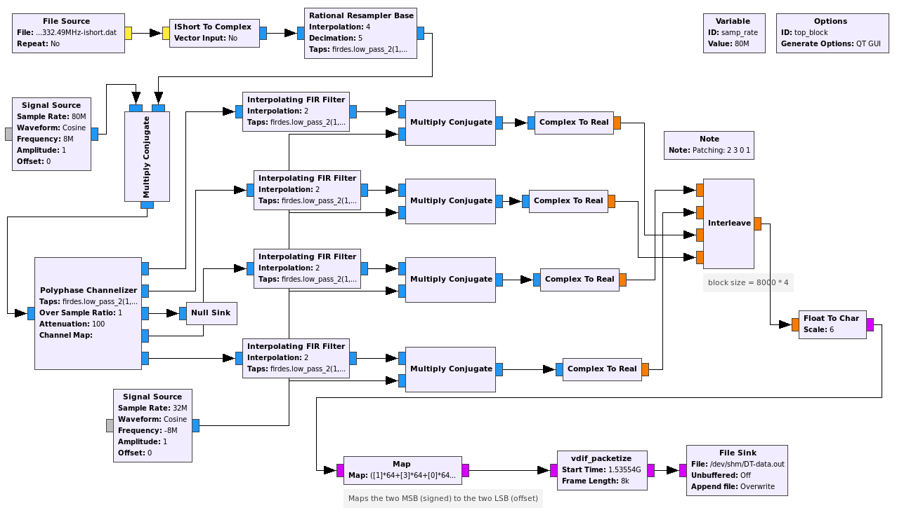
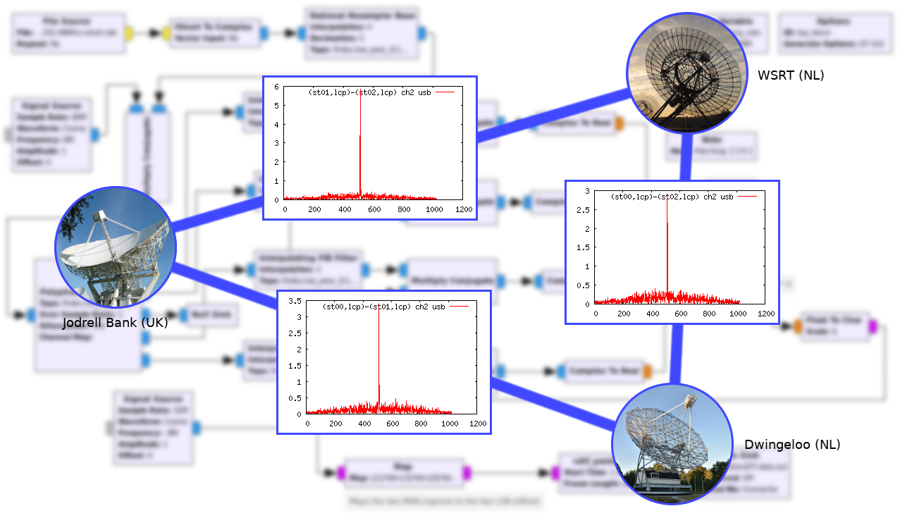

# gr-vdif
> A gnuradio block to add VDIF (and VTP) headers to a stream of samples.

## Table of Contents
* [Introduction](#introduction)
* [Usage](#usage)
* [Example](#example)
* [Requirements](#requirements)
* [TODO](#todo)
* [Contact](#contact)
* [License](#license)
* [Publications](#publications)
* [Acknowledgements](#acknowledgements)

## Introduction

What is VDIF? What is VLBI?

VLBI stands for Very Long Baseline Interferometry, a technique in radio
astronomy where a source is observed by a geographically distributed array
of radio telescopes. These telescopes form a radio interferometer, and its
resolution is determined by the largest distance between participating
telescopes and the observing wavelength. In VLBI, participating dishes can
be separated by continental distances, and longer when space based radio
telescopes contribute as well.

VDIF is the VLBI Data Interchange Format, a standard that describes how to
format and store the timestamps and digitized radio spectrum. Having such
a standard makes it much easier to exchange recordings. The VDIF standard
is available at https://vlbi.org/vlbi-standards/vdif/

Gr-vdif is a GNU Radio out-of-tree module that can be used to apply VDIF
headers to a VLBI recording. It allows one to use a COTS (commercial off the
self) SDR (software defined radio) to digitize some portion of the radio
spectrum, use the already existing DSP blocks in GNU Radio to create subbands
with the correct sample rate and perform quantization (usually 2 bit), and
finally the gr-vdif block to generate the required VDIF headers.

This is not intended to replace the bespoke formatters in use at regular VLBI
telescopes. For the high bandwidths used in most VLBI observations, the
software doesn't even come near to real time performance. It is however
useful for cheaply adding limited VLBI capabilities to existing dishes, for
comissioning, and to test correlator systems. Recorded SDR samples can be
re-run through different configurations, permitting research on the effects
of e.g. subband width, complex vs. real samples, filter taps and more.

## Usage

At the moment, gr-vdif expects its data to be real (not complex), 2-bit sampled at 32 MS/s (16 MHz subbands). The data must be delivered as an interleaved
stream of samples, where the interleaving should be done in blocks that
equal the configured frame length. See the 'example' section for a setup that
is known to work. This interface can certainly be improved
upon, and is therefore subject to change.

# Example

The flowchart depicted below takes the output of one TwinRX module (80 MHz of spectrum, sampled at 100MS/s complex, stored as interleaved shorts). Out of this,
four subbands of each 16 MHz wide are extracted, conveted into real (USB) 
samples sampled at 32MS/s. The data is then interleaved by groups of 32000 
samples (corresponding to the requested framelength of 8000 bytes), before
being fed into the gr-vdif OOT block. This block then adds the VDIF headers.

This particular flowchart was used to achieve fringes between the Dwingeloo,
WSRT and Jodrell Bank radio telescopes, as depicted in the second image. For
more details on these experiments, see the `publications' section.

## Requirements

* The module is written for GNU Radio 3.8.x

## TODO

This software is in a very preliminary stage, and many features are missing or
not yet fully implemented. Below is a list of items that are on my TODO list:

* Verify with different number of channels (4 is known to work)
* Implement VTP counter
* Allow complex data as well as real
* Make sample rate configurable (currently only 32 MS/s is supported)
* Show real-time sampler stats
* AGC, power measurements and logging for T_sys data
* Read timestamps from recorded samples
* Configure number of channels from the number of input ports

## Contact

This software was written by Paul Boven <boven@jive.eu>

## License

This is free sofware; you can distribute it and/or modify it under the termsp of of the GNU General Public License as
published by the Free Software Foundation; either version 3, or (at your option) any later version.

This software is distributed in the hope that it will be useful, but WITHOUT
ANY WARRANY; without even the implied warranty of MERCHANTABILITY or FITNESS
FOR A PARTICULAR PURPOSE. See the GNU General Public License for more details.

You should have received a copy of the GNU General Public License along with
this software; see the file COPYING. If not, please write to the Free
Software Foundation, Inc,. 51 Franklin Street, Boston, MA 02110-1301, USA.

## Publications

The results from our initial VLBI tests have been published in:

* Proceedings of the 14th EVN Symposium and Users' Meeting, Granada, 2020
https://pos.sissa.it/344/156/pdf

## Acknowledgements

This work would not have been possible without all the dedicated volunteers that are maintaining the Dwingeloo Radio Telescope. To learn more about our
historic instrument, visit http://www.camras.nl/en .

Part of this work was funded through the ASTERICS project, a project supported
by the European Commission Framework Program Horizon 2020 Research and
Innovation action under grant agreement n. 653477.

My colleagues at JIVE who helped with bugfixes and testing this software, and
who taught me how to process experiments on the EVN correlator at JIVE. ASTRON
for their support to the project and access to the hydrogen maser and a dish
at the WSRT, and Jodrell Bank Observatory for participating in some of the
test observations as well.
